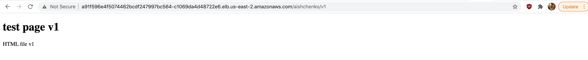

- Task 1

http://a91f596e4f5074462bcdf247997bc564-c1069da4d48722e6.elb.us-east-2.amazonaws.com/aishchenko/v1

http://a91f596e4f5074462bcdf247997bc564-c1069da4d48722e6.elb.us-east-2.amazonaws.com/aishchenko/v2

*
- Task 2

helm install test1 ./test --set app.version=v1 --set app.user=aishchenko

helm install test2 ./test --set app.version=v2 --set app.user=aishchenko

